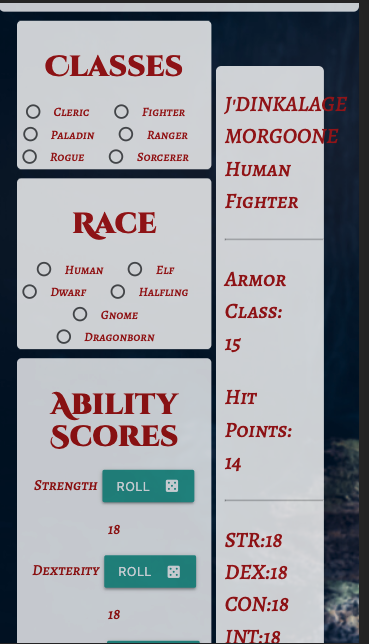

# Project-3

## Description

"Group Gr8 Character Creator" is a React app for creating and storying basic player characters in Dungeons & Dragons (5th Edition).

## Live App

https://www.heroku.com/ (Update once deployed)

## Desktop Screenshots
<br>


<br>

## Mobile Screenshots
<br>



<br>

## Installation

To run locally: <br>
-Clone the repo from https://github.com/Group8-Project3/Project-3 <br>
-Run:
```
npm install
```
-Then:
```
npm start
```
-The app will auto run on port 3000.

## Usage

Register for an account, then log in. Add your character's name, then select their race, class, and roll for abilities. Created characters will be stored on the "Created Characters" page.

## Contributing

After 3/23/2021, pull requests are welcome. Please open an issue first to discuss changes.

## Credits

#### Christian Goldman
-GitHub: https://github.com/ChristianGoldman <br>
-Email: christian.goldman9638@gmail.com<br>

